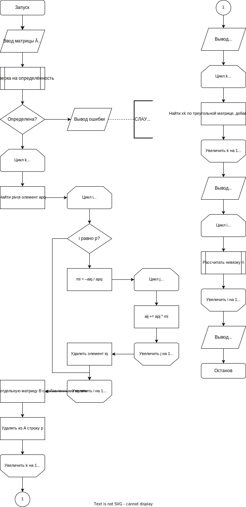

## 1. Описание метода. Расчётные формулы.
### Вступление
Матричный способ записи СЛАУ:
$$\begin{cases}
    a_{11}x_1 + ... + a_{1n}x_n = b_1 \\\\
    .................................... \\\\
    a_{n1}x_1 + ... + a_{nn}x_n = b_n \\\\
\end{cases}
\implies
A\cdot X = B, где A = \begin{pmatrix}
    a_{11} & ... & a_{1n} \\\\
    ... & ... & ...\\\\
    a_{n1} & ... & a_{nn} \\\\
\end{pmatrix}
B = \begin{pmatrix}
    b_1\\\\
    ...\\\\
    b_n\\\\
\end{pmatrix}
X = \begin{pmatrix}
    x_1\\\\
    ...\\\\
    x_n\\\\
\end{pmatrix}$$

### Описание метода
Метод Гаусса с выбором главного элемента — прямой метод решения системы линейных уравнений. В основе лежат элементарные преобразования и сведение матрицы к треугольной форме. Состоит из двух этапов: сведение расширенной матрицы СЛАУ к треугольному виду (прямой ход) и собственно вычисления значений неизвестных (обратный ход).

Реализация метода Гаусса с выбором главного элемента отличается от простого метода Гаусса тем, что необходимо выбирать на каждом шаге главный элемент, а не просто использовать $a_{11}$. Этот элемент может быть найден как:
- максимальный элемент первой строки (тогда нужно будет переставить столбцы)
- максимальный элемент первого столбца (тогда нужно будет переставлять строки)
- максимальный элемент всей матрицы (тогда переставлять нужно будет и строки, и столбцы)

### Прямой ход
Выполняется по шагам, всего шагов столько же, сколько уравнений в СЛАУ. На какждом шаге:
1. находим в $A$ главный элемент $a_{pq}$
2. вычисляем для каждого индекса строки $i \ne p$ множитель $m_i$:
$$m_i = \frac{-a_{iq}}{a_{pq}}$$
3. к каждой $i$-й строке прибавляем $p$-ю, умноженную на $m_i$
4. сохраняем $p$-ю строку матрицы для обратного хода (добавляем в треугольную матрицу)
5. убираем из матрицы $p$-ю строку и $q$-й столбец

СЛАУ, составленная по полученной треугольной матрице будет выглядеть так:

$$\begin{cases}
    ȧ_{11}ẋ_1 + ... + ȧ_{1n}ẋ_n = ḃ_1\\\\
    ȧ_{22}ẋ_2 + ... + ȧ_{2n}ẋ_n = ḃ_2\\\\
    ....................................\\\\
    ȧ_{n-1n-1}ẋ_{n-1} + ȧ_{n-1n}ẋ_n = ḃ_{n-1}\\\\
    ȧ_{nn}ẋ_n = ḃ_n\\\\
\end{cases} $$

*из-за перестановок индексы неизвестных могут не совпадать с изначальными, при реализации главное сохранить их в памяти для обратного хода.

### Обратный ход
Пройдёмся по строкам, сохранённым во время прямого хода, в обратном порядке. Для самой последней найти неизвестную просто, в одной действие. Далее считаем неизвестные по одной, пользуясь информацией о других неизвестных. 

## 2. Блок-схема 


## 3. Листинг численного метода
```py
class EquationSystem(Matrix):
    ...

    def _row_pivot(self, i, row) -> tuple[int, int, Decimal]:
        result = max(enumerate(row[:-1]), key=lambda x: abs(x[1]))
        return i, result[0], result[1]

    def pivot_element(self) -> tuple[int, int, Decimal]:
        return max((self._row_pivot(i, row) 
                    for i, row in enumerate(self)), key=lambda x: abs(x[2]))

    def _solve(self, result_mapping: list[int] = None) \
            -> dict[int, tuple[Decimal, Row, list[int]]]:
        if result_mapping is None:
            result_mapping = list(range(self.size[0]))
        if len(result_mapping) == 0:
            return {}

        p, q, value = self.pivot_element()
        main_row = self[p].copy()

        for i in range(self.size[0]):
            if i == p:
                continue
            coefficient: Decimal = -(self[i][q] / value)
            self[i] += main_row * coefficient

        self.drop_row(p)
        self.drop_column(q)
        rm = result_mapping.copy()
        result_index = result_mapping.pop(q)

        result_dict = self._solve(result_mapping)
        result: Decimal = main_row[-1]
        for i, x in result_dict.items():
            result -= main_row[rm.index(i)] * x[0]
        result /= main_row[q]
        result_dict[result_index] = result, main_row, rm

        return result_dict

    def solve(self) -> tuple[Row, EquationSystem]:
        result = self._solve()

        def triangle_row_sort(args):
            i, row = args
            if i == len(triangle) - 1:
                return -1
            return row.data.count(Decimal(0))

        triangle = EquationSystem(
            [Row([*(row[rm.index(i)] if i in rm else 0
                    for i in range(len(result))), row[-1]])
             for _, row, rm in reversed(result.values())])
        triangle.transpose()
        columns = sorted(enumerate(triangle), reverse=True,
                         key=triangle_row_sort)
        triangle = EquationSystem([column for _, column in columns])
        triangle.transpose()

        return Row([x[1] for x in sorted([
            (k, v[0]) for k, v in result.items()], 
            key=lambda x: x[0])]), triangle
```

## 4. Примеры работы программы
### Система 1
$$ \begin{cases}
    x_1 + 2x_2 = 2\\\\
    3x_1 + 2x_2 = 4\\\\
\end{cases} $$
### Ввод 1 (с клавиатуры с подсказками от программы)
```txt
1. Enter a matrix from keyboard
2. Read a matrix from file
3. Generate a random matrix
4. Quit
Enter the preferred input method: 1
Enter row #1: 1 2 2
Enter row #2 (3 numbers): 3 2 4
```
### Результат 1
```txt
Input Matrix:
{
 1 2 2
 3 2 4
}

Triangle Matrix:
{
 3 2 4
 0 1.33333333333333333333333333333333333 0.66666666666666666666666666666666667
}

Solution: 1 0.5
Residuals: 0 0
```

### Система 2
$$ \begin{cases}
    3x_1 - x_2 + 2x_3 = 4\\\\
    2x_1 + 5x_2 - x_3 = 23\\\\
    x_1 - x_2 + 7x_3 = 5\\\\
\end{cases} $$

### Ввод 2 (содержимое входящего файла)
```txt
 3 -1  2  4
 2  5 -1 23
 1 -1  7  5
```

### Результат 2
```txt
Input Matrix:
{
 3 -1 2 4
 2 5 -1 23
 1 -1 7 5
}

Triangle Matrix:
{
 7 -1 1 5
 0 4.85714285714285714285714285714285714 2.14285714285714285714285714285714286 23.71428571428571428571428571428571429
 0 0 3.02941176470588235294117647058823529 6.05882352941176470588235294117647059
}

Solution: 2 4 1
Residuals: 0 0 0
```

### Ввод 3 (выбор и настройка рандомной СЛАУ)
```txt
1. Enter a matrix from keyboard
2. Read a matrix from file
3. Generate a random matrix
4. Quit
Enter the preferred input method: 3
Do you want to use integers only? yep
Enter the row count (2 to 20): 3
```

### Результат 3
```txt

Input Matrix:
{
 3 3 -8 -74
 -8 -4 0 24
 -6 -2 2 26
}

Triangle Matrix:
{
 -8 3 3 -74
 0 -8 -4 24
 0 0 1.375 -8.25
}

Solution: 0 -6 7
Residuals: 0 0 0

Generated Inputs: 0 -6 7
Difference From Solution: 0 0 0
```

## 5. Вывод
В результате выполнения лабораторной работы я разобрался с решением систем линейных уравнений через прямой метод (Метод Гаусса с выбором главного элемента). Вычислительная сложность данного метода зависит только от размеров СЛАУ, и равна $O(n^3)$, где $n$ – кол-во неизвестных.

Прямые методы применимы на сравнительно небольших неразреженных матрицах, когда нужна высокая точность и гарантия нахождения ответа, если он существует, за конечное количество операций. Однако при вычислении на компьютере можно быстро столкнуться с проблемой в точности из-за ограниченности разрядной сетки. 

В моём решении я попробовал этому противостоять, использовав не стандартный float, а Decimal, который позволяет значительно повысить точность и избежать ошибок из-за конвертирования двоичных чисел в десятичные. В корректности работы убедился, результаты почти всегда совпадают с реальными, а максимальная замеченная разница составляет 1.$1E-39$ из-за выбранной точности Decimal (42 знака после запятой).

Метод Гаусса с выбором главного элемента частично перекрывает один из недостатков простого метода Гаусса: лучше работает с разреженными матрицами. Однако для больших вычислений, когда не нужна абсолютная точность, на много выгоднее использовать итерационные методы, они работают гораздо эффективнее, как по времени, так и по памяти.
