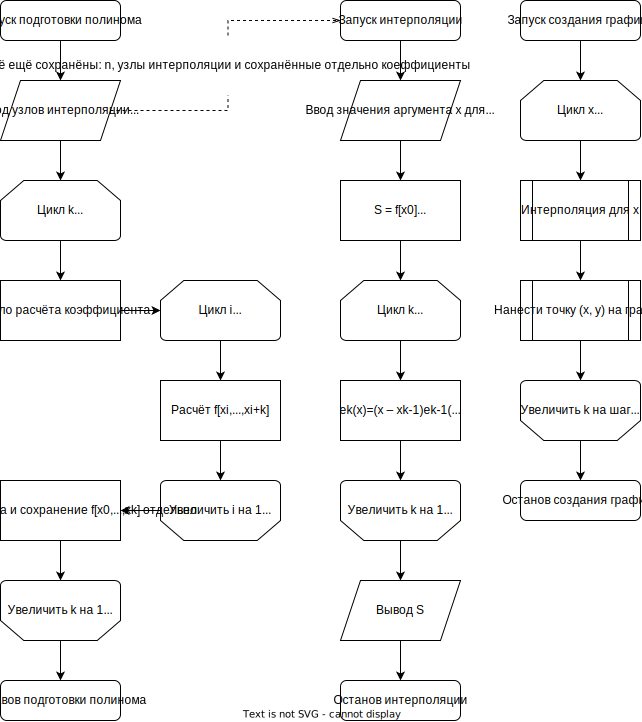
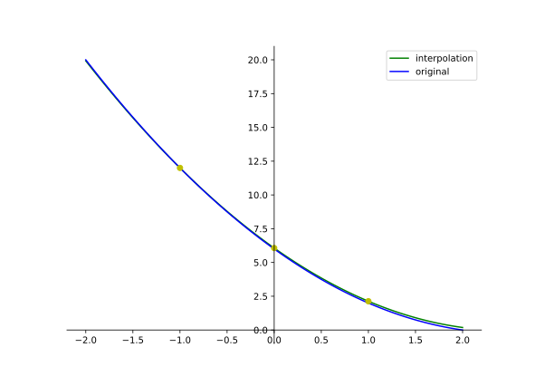
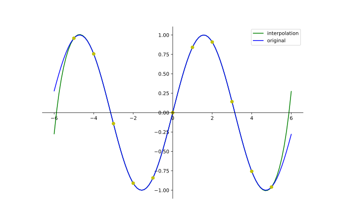

## 1. Описание метода. Расчётные формулы.
Метод Ньютона полагается на составление полинома $n$-ой степени по $n$ узлам интерполяции, причём каждая следующая точка не зависит от предыдущих, что позволяет увеличивать полином без полной перестройки.

Общая формула полинома:
$$P_n(x) = \sum^n_{k=0}f[x_0,...,x_k]e_k(x)$$

Где $f[x_0,...,x_k]$ — разделённая разница, определённая рекурсивной формулой:

$$f[x_i,x_{i+1},...,x_{k-1},x_k] = \frac{f[x_{i+1},...,x_{k-1},x_k] - f[x_i,x_{i+1},...,x_{k-1}]}{x_k - x_i}; f[x_i] = f(x_i); где 0 \le i < k < n$$

А $e_k(x)$ определяется формулой:

$$e_k(x) = \prod^{k-1}_{i=0}\left(x-x_i\right); но e_0(x) = 1$$

## 2. Блок-схема 


<br>
<br>
<br>

## 3. Листинг численного метода
```py
class Interpolator:
    def interpolate_one(self, xi: Decimal) -> Decimal:
        raise NotImplementedError()

    def interpolate_row(self, xs: Row) -> Row:
        return xs.map(self.interpolate_one)


class LagrangeInterpolator(Interpolator):
    def _coefficient(self, index: int, xs: Row, ys: Row):
        index += 1
        result: Decimal = Decimal()
        for i in range(index):
            divider = Decimal(1)
            for k in range(index):
                if k != i:
                    divider *= xs[i] - xs[k]
            result += ys[i] / divider
        return result

    def __init__(self, xs: Row, ys: Row):
        self.size: int = xs.size
        self.xs: Row = xs
        self.coefficients = [self._coefficient(i, xs, ys) for i in range(self.size)]

    def interpolate_one(self, xi: Decimal) -> Decimal:
        result: Decimal = Decimal()
        multiplier = Decimal(1)
        for i in range(self.size):
            result += multiplier * self.coefficients[i]
            multiplier *= xi - self.xs[i]
        return result

class NewtonInterpolator(Interpolator):
    def _coefficients(self, xs: Row, ys: Row) -> list[Decimal]:
        dynamic: list[list[Decimal]] = [[y for y in ys]]
        result: list[Decimal] = [dynamic[-1][0]]

        for k in range(1, xs.size):
            dynamic.append([])
            for i in range(xs.size - k):
                dynamic[-1].append((dynamic[-2][i + 1] - dynamic[-2][i]) 
                                   / (xs[i + k] - xs[i]))
            result.append(dynamic[-1][0])

        return result

    def __init__(self, xs: Row, ys: Row):
        self.size: int = xs.size
        self.xs: Row = xs
        self.coefficients = self._coefficients(xs, ys)

    def interpolate_one(self, xi: Decimal) -> Decimal:
        result: Decimal = Decimal()
        multiplier = Decimal(1)
        for i in range(self.size):
            result += multiplier * self.coefficients[i]
            multiplier *= xi - self.xs[i]
        return result
```

<br>
<br>

## 4. Примеры работы программы
### Пример 1 (квадратичная функция с шумом)
- Исходная функция: $y = x^2 - 5x + 6$
- Узлы интерполяции: $(-1; 12), (0; 6.06926668129476887), (1; 2.13192824885710452)$
- Полученный полином:
$P_3(x) = 12 - 5.9307(x + 1) + 0.9968(x + 1)x$
- Полученный график:
  


### Пример 2 (синусоида без шума)
- Исходная функция: $y = \sin x$
- Узлы интерполяции: $(-5; 0.96), (-4; 0.76), (-3; -0.14), (-2; -0.91), (-1; -0.84), (0; 0), (1; 0.84), (2; 0.91), (3; 0.14), (4; -0.76), (5; -0.96)$
- Коэффициенты полинома: $0.96, -0.2, -0.35, 0.14, 0, -0.01, 0, 0, 0, 0, 0$
- Полученный график:
  


## 5. Вывод
Выполнив эту работу я изучил два из трёх предложенных методов интерполирования, методы Лагранжа и Ньютона (иначе называемые интерполяционными полиномами), краткое сравнение всех трёх:
- Метод Лагранжа: более простой в подсчёте и более быстрый на простых функциях. Однако метод плохо справляется с добавлением новых коэффициентов (необходимо перестроить весь полином и сложность значительно возрастает с ростом количества точек)
- Метод Ньютона: сложнее при изначальном расчёте коэффициентов, но зато позволяет проще добавлять новые точки (предыдущие не зависят от старых), однако шум всё ещё существенно влияет на весь полином
- Метод Кубических Сплайнов: сильно отличается от двух других, что, с одной стороны, позволяет значительно снизить его сложность для настройки и повысить точность (в частности это заметно при большом количестве точек), а с другой стороны значительно усложняет его реализацию

Также в этой лабораторной работе я научился аппроксимировать функции через метод наименьших квадратов (ибо подумал, что это обязательное дополнение ко всем вариантам, а не отдельный вариант). Аппроксимация даёт гораздо меньшую точность, но как проста в реализации, так и хороша по скорости расчёта и будет использоваться когда точность нужна минимальная или характер зависимости известен заранее.

Сложности приведённых алгоритмов:
- Метод Лагранжа: подготовка: $O(n^2)$, расчёт одной точки: $O(n)$
- Метод Ньютона: подготовка: $O(n^2)$, расчёт одной точки: $O(n)$
- Метод Сплайнов: подготовка: $O(n)$, расчёт одной точки: $O(1)$
