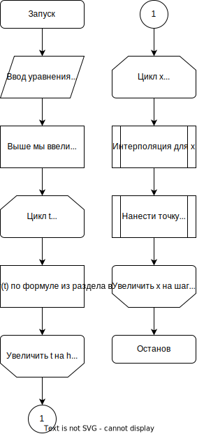
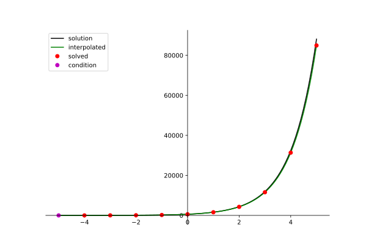
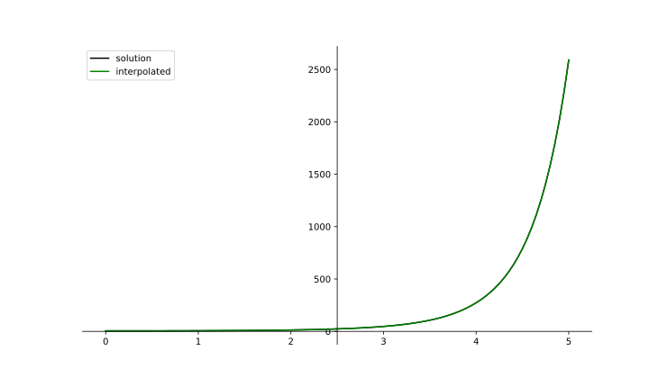
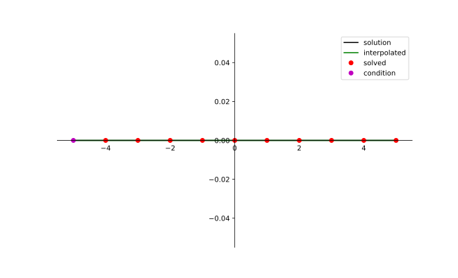

## 1. Описание метода. Расчётные формулы.
Пусть нам нужно решить задачу Коши для обыкновенного дифференциального уравнения вида:
$y' = f(x, y)$

Тогда применим метод Рунге-Кутты четвёртого порядка — одношаговый метод решения задачи Коши, шаг которого определяется формулой ($h$ — размер шага по $x$):
$$y_{i+1} = y_{i} + \frac{1}{6}\left(k^{(i)}_1 + 2k^{(i)}_2 + 2k^{(i)}_3 + k^{(i)}_4\right)$$

$$k^{(i)}_1 = hf(x_i, y_i);k^{(i)}_2 = hf\left(x_i + \frac{h}{2}, y_i + \frac{k^{(i)}_1}{2}\right)$$

$$k^{(i)}_3 = hf\left(x_i + \frac{h}{2}, y_i + \frac{k^{(i)}_2}{2}\right);k^{(i)}_4 = hf\left(x_i + \frac{h}{2}, y_i + k^{(i)}_3\right)$$

## 2. Блок-схема 


## 3. Листинг численного метода
```py
class EquationProtocol(Protocol):
    def __call__(self, x: Decimal, y: Decimal) -> Decimal:
        pass


class ODESolver:
    def __init__(self, step_size: Decimal, point_count: int):
        self.step_size = step_size
        self.point_count = point_count

    def _solve(self, equation: EquationProtocol, start_x: Decimal, start_y: Decimal) -> list[tuple[Decimal, Decimal]]:
        raise NotImplementedError()

    def solve(self, equation: EquationProtocol, start_x: NUMBER, start_y: NUMBER) -> list[tuple[Decimal, Decimal]]:
        return self._solve(equation, *map(number_to_decimal, (start_x, start_y)))

    def solve_as_rows(self, equation: EquationProtocol, start_x: NUMBER, start_y: NUMBER) -> tuple[Row, Row]:
        result = self.solve(equation, start_x, start_y)
        return Row([r[0] for r in result]), Row([r[1] for r in result])


class SingleStepODES(ODESolver):
    def _delta_y(self, equation: EquationProtocol, x_n: Decimal, y_n: Decimal) -> Decimal:
        raise NotImplementedError()

    def _one_step(self, equation: EquationProtocol, x_n: Decimal, y_n: Decimal) -> tuple[Decimal, Decimal]:
        return x_n + self.step_size, y_n + self.step_size * self._delta_y(equation, x_n, y_n)

    def _solve(self, equation: EquationProtocol, start_x: Decimal, start_y: Decimal) -> list[tuple[Decimal, Decimal]]:
        r = start_x, start_y
        return [r] + [r := self._one_step(equation, *r) for _ in range(self.point_count)]

class RungeKuttaODES(SingleStepODES):
    def _delta_y(self, equation: EquationProtocol, x_n: Decimal, y_n: Decimal) -> Decimal:
        t: Decimal = self.step_size / 2
        k1: Decimal = equation(x_n, y_n)
        k2: Decimal = equation(x_n + t, y_n + t * k1)
        k3: Decimal = equation(x_n + t, y_n + t * k2)
        k4: Decimal = equation(x_n + self.step_size, y_n + self.step_size * k3)
        return (k1 + 2 * k2 + 2 * k3 + k4) / 6
```

## 4. Примеры работы программы
### Пример 1
$$y' = y при y(-5) = 4, h = 1, x_n = 5$$



### Пример 2
$$y' = \frac{xy}{2} при y(0) = 5, h = 0.1, x_n = 5$$



### Пример 3
$$y' = \frac{xy}{2} при y(-5) = 0, h = 1, x_n = 5$$



## 5. Вывод
Во время выполнения этой работы я познакомился со всеми предложенными методами, хотя этот отчёт и был урезан только до того, что написан у меня в варианте. Все методы призваны решать задачу Коши для обыкновенных дифференциальных уравнений.

Методы делятся на одношаговые и многошаговые. Первые проще в реализации и быстрее вычисляют одну итерацию, вторые же точнее и устойчивее. Кроме того многошаговые методы для решения задачи Коши требуют вычисления нескольких первых точек при помощи некоторого одношагового метода.

- Метод Эйлера. Прост в реализации, быстр на одну итерацию но сильно теряет в точности и устойчивости по сравнении с другими.
- Усовершенствованный метод Эйлера. Слегка сложнее в реализации, и медленнее на итерацию, но гораздо более точный и устойчивый, чем метод выше. Это достигается через корректировку изменений $y$ через использование дополнительной точки в середине отрезка.
- Метод Рунге-Кутты четвёртого порядка. Использует ещё больше промежуточных значений, чем предыдущий, поэтому сложнее на итерацию, но значительно точнее и устойчивее.
- Метод Адамса. Основан на использовании полинома Лагранжа, использует в вычислениях четыре предыдущие точки. Имеет высокую точность и устойчивость.
- Метод Милна. Очень похож на предыдущий, но основан на использовании полинома Ньютона.
